# Guida alla configurazione del repository

## Indice

- Accettazione assignment del primo componente e creazione repository su GitHub
- Accettazione assignment degli altri componenti e accesso al repository su GitHub
- Configurazione del repository su GitHub
  - Impostazione del GitHub Secret
  - Abilitazione package/immagini Docker
  - Aggiunta del badge di GitHub Actions nel README

## Accettazione assignment del primo componente e creazione repository su GitHub

Mettersi d'accordo su chi sarà il primo componente del gruppo che accetterà l'*assignment* su GitHub Classroom.

**Le seguenti azioni sono di responsabilità del componente designato dal gruppo**:

- Il componente designato dal gruppo dovrà scrivere sul canale `Formazione gruppi` di Teams un messaggio rivolto al docente (usare il *mention* con *@*) dichiarando che "il gruppo *x* è pronto" dove *x* è il nome del gruppo.
- Il docente risponderà inviando allo studente in chat privata il link di assegnazione del progetto.
- Cliccare sul link di assegnazione del progetto che il docente ha inviato in chat privata su Teams.
- Scorrere la lista e cliccare sul proprio indirizzo di email
  

- Creare il team scrivendo il nome prescelto e cliccando sul pulsante verde `Create team`.
- Aspettare che GitHub Classroom cloni il repository base per te.
  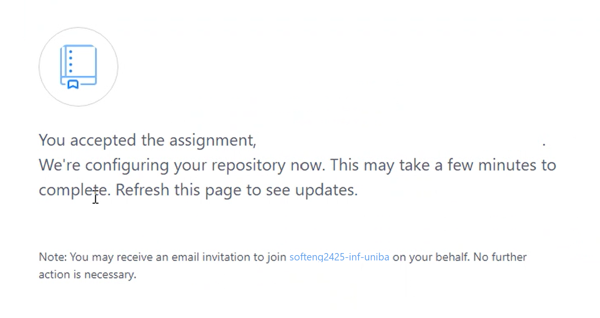
- *Fai un refresh della pagina web per verificare il completamento.
  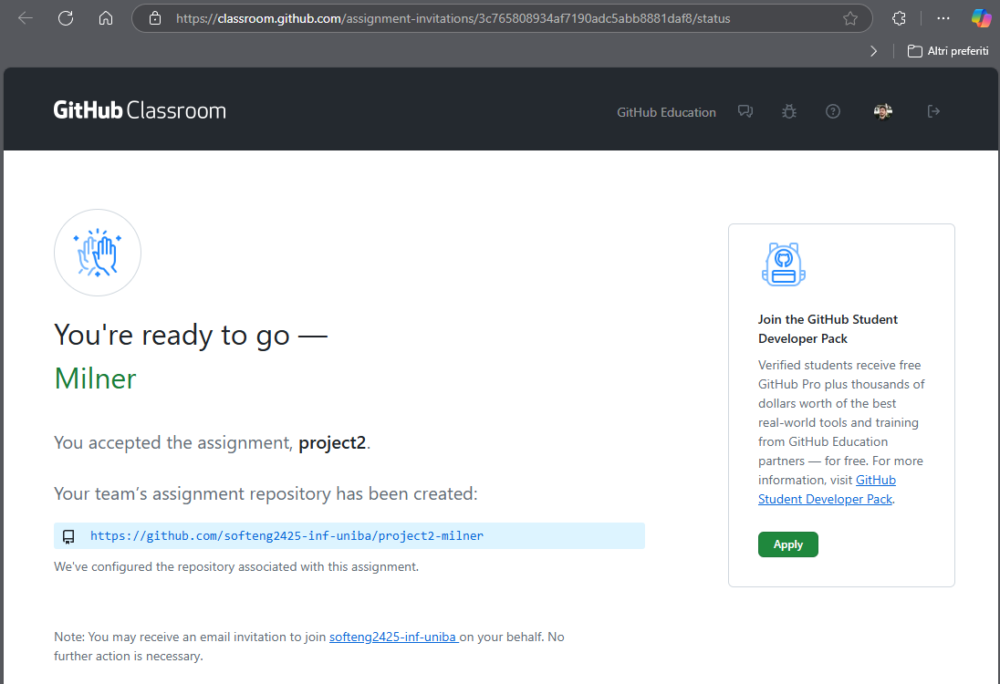

- Comunicare al docente in chat l'esito della creazione.
- Comunicare agli altri componenti del gruppo il link di assegnazione del progetto precedentemente inviato dal docente.

## Accettazione assignment degli altri componenti e accesso al repository su GitHub

**Le seguenti azioni sono di responsabilità di tutti i componenti tranne quello designato per la creazione del repository**:

- Cliccare sul link di assegnazione del progetto ricevuto dal collega designato.
- Scorrere la lista e cliccare sul proprio indirizzo di email
  

- Unisciti al tuo team cliccando il corrispondente pulsante `Join`
   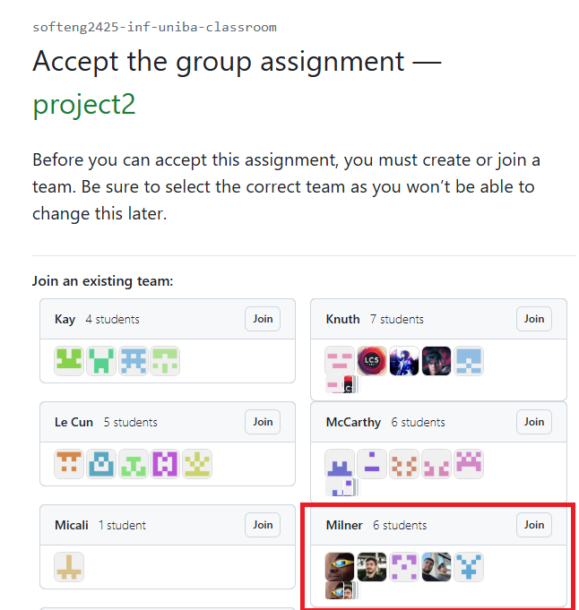

**Se non trovi il team è probabile che l'assignment sia stato accettato prima della creazione del team. Fermarsi e avvisare il componente designato dal gruppo.**

- Se ti sei unito a un team già creato, dovrai prima confermare la scelta e quindi avrai subito la conferma.
   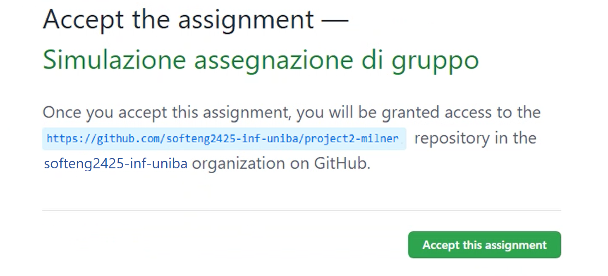

- Questo passo terminerà con successo se tutti i componenti del gruppo potranno accedere al repository.

## Configurazione del repository su GitHub

Il repository che vi è stato assegnato contiene tutto il necessario per cominciare lo sviluppo della vostra applicazione. Oltre a una versione base del codice sorgente, esso presenta la struttura di directory alla quale dovrete attenervi durante lo svolgimento del progetto e i file di configurazione per i principali strumenti inclusi nella pipeline.

In particolare, in `.github/workflows`, trovate due file di configurazione di GitHub Actions, denominati `gradle_build.yml` e `docker_build&push.yml`. [Actions](https://github.com/features/actions) è una funzionalità di GitHub che consente la definizione e l'esecuzione automatizzata di pipeline di Continuous Integration / Continuous Deployment (CI/CD). In GitHub Actions, i passaggi di una pipeline vengono specificati in un file `.yml`, detto *workflow*. Generalmente, le pipeline di CI/CD comprendono operazioni di testing, releasing e deployment di un sistema software. Nello specifico,
per il vostro progetto sono state definite due pipeline.

La prima pipeline, definita nel file `gradle_build.yml`, viene innescata da ogni Pull Request e realizza i seguenti passaggi:

1. il testing del vostro codice (unit test con [JUnit](https://junit.org/))
2. l'analisi dello stesso con strumenti di quality assurance ([Checkstyle](https://checkstyle.org/), [Spotbugs](https://spotbugs.github.io));

La seconda pipeline, definita nel file `docker_build&push.yml`, viene innescata dalle operazioni di push e merge sul branch `main`; oltre a svolgere gli stessi passaggi effettuati dalla prima, effettua la costruzione di un'immagine Docker con la vostra applicazione e il caricamento della stessa su [GitHub Packages](https://github.com/features/packages).

**N.B.**: entrambi i workflow si attivano soltanto se le modifiche nei commit riguardano file contenuti nelle cartelle `scacchi/` e `tests/` del repository o il file `pyproject.toml`. In questo modo evitiamo che i workflow si attivino anche in caso di modifiche minori che non avrebbero alcun effetto sul funzionamento del vostro programma (ad esempio, modifiche al file `README.md` o alla documentazione).

Affinché il caricamento dell'immagine Docker su GitHub Packages vada a buon fine, è necessario un piccolo intervento da parte vostra, da svolgere soltanto una volta, nella fase di impostazione iniziale del progetto. Dal momento che ciascuna nuova esecuzione del workflow avviene in una macchina virtuale Ubuntu costruita ex-novo da GitHub Actions, è necessario che - ad ogni run - il processo preposto al caricamento dell'immagine Docker su Packages si autentichi al servizio (effettuando un login). Al posto della classica coppia di credenziali (username e password) è possibile usare, a questo scopo, un Personal Access Token (PAT) di GitHub, da passare in input al comando che effettua la connessione a Packages. Tuttavia, dal momento che tale comando viene riportato in chiaro nel file di workflow (`docker_build&push.yml`), passare in input il token in modo esplicito significherebbe memorizzarne una copia che resti visibile a chiunque abbia accesso al repository; ciò non è affatto sicuro e andrebbe assolutamente evitato perché un token è strettamente personale. Per questo genere di esigenze, GitHub offre ai suoi utenti un'ulteriore funzionalità, i cosiddetti Secrets, valori crittografati associati ai repository e accessibili come variabili d'ambiente all'interno dei workflow. Una volta generato, il PAT può essere memorizzato in tutta sicurezza in un Secret. Al momento opportuno, il valore ivi contenuto verrà passato al comando di accesso a Packages che ne ha bisogno.

L'intervento iniziale a voi richiesto deve essere svolto *da un solo membro del team* che dovrà avere un Personal Access Token con un set minimale di scope che include `repo` (con tutte le relative sotto-voci) e `write:packages`.

## Impostazione dei GitHub Secret

A questo punto, il membro designato del team dovrà:

- recarsi sulla pagina principale del repository e fare click sull'icona *"Settings"* (ultima tab in alto a destra);
  **N.B.**: solo l'amministratore visualizza questa tab!
  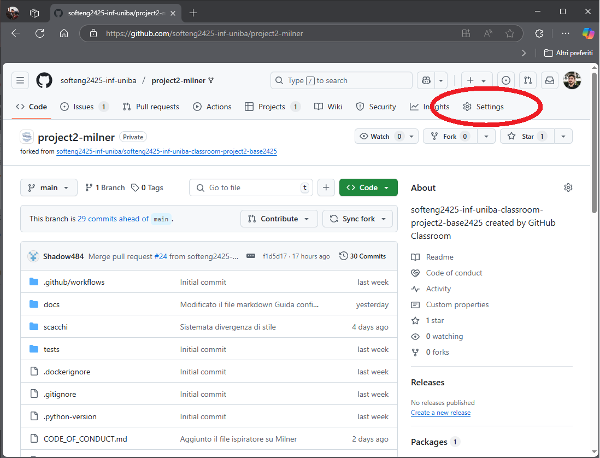
- selezionare la voce *"Secrets and variables"*, quindi la sotto-voce *"Actions"* dalla barra laterale;
  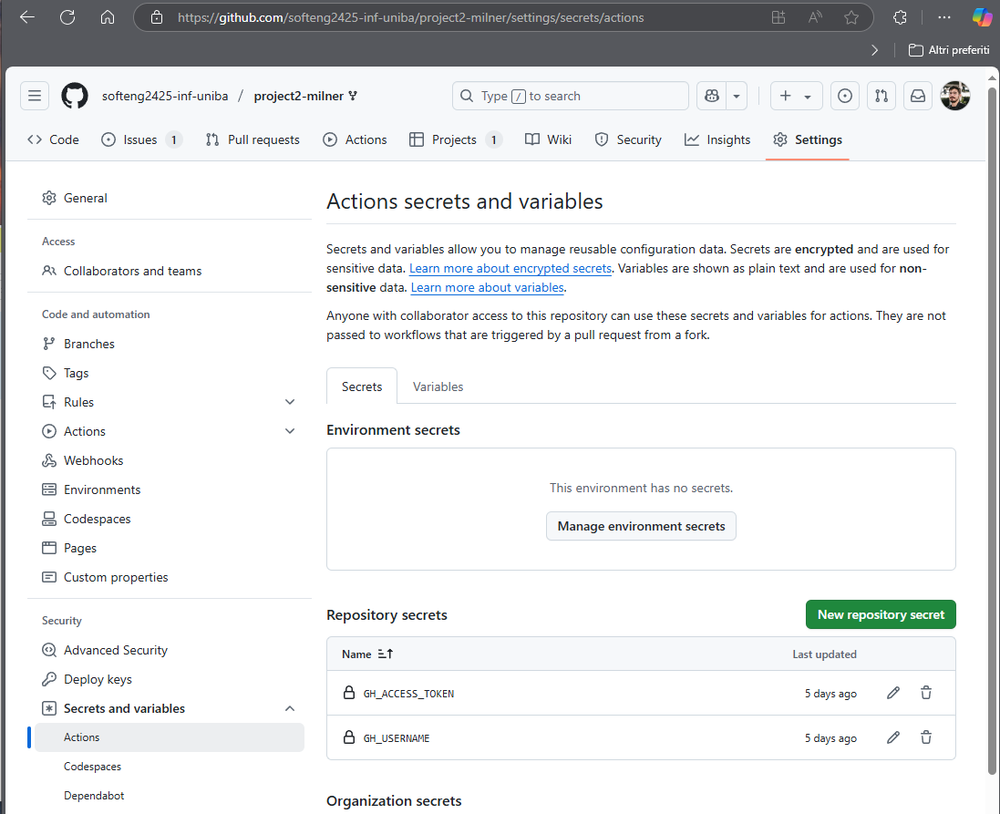
- fare click sul pulsante *"New repository secret"*:
 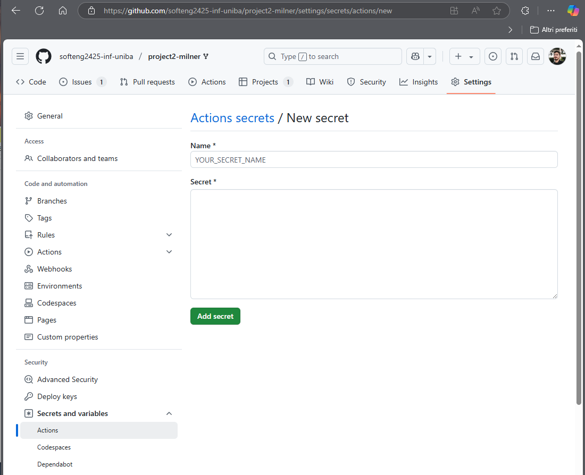
  - inserire la stringa `GH_ACCESS_TOKEN` nella textbox con l'etichetta *"Name"*;
  - inserire il Personal Access Token precedentemente generato nella textarea con l'etichetta *"Secret"*;
  - concludere l'operazione cliccando sul pulsante *"Add secret"*.
- ripetere l'operazione per l'aggiunta di un secret col proprio username: fare click sul link *"New repository secret"*;
  - inserire la stringa `GH_USERNAME` nella textbox con l'etichetta *"Name"*;
  - inserire il proprio username GitHub nella textarea con l'etichetta *"Secret"*;
  - concludere l'operazione cliccando sul pulsante *"Add secret"*.

**N.B.:** È fondamentale che i nomi dei due GitHub Secret vengano scritti esattamente come sono riportati in questa guida: `GH_ACCESS_TOKEN` e `GH_USERNAME`(rispettando le maiuscole e gli underscore).

## Abilitazione package/immagini Docker

Affinché tutti i membri del team possano visualizzare e scaricare l'immagine Docker del proprio progetto da GitHub Packages, è necessario che colui che ha inserito il proprio Personal Access Token tra i secret del repository svolga i seguenti passaggi.

1. Accedere al proprio repository su GitHub.
2. Cliccare sulla tab *"Actions"* (subito sotto il titolo, in alto al centro) e verificare che il workflow `docker_build&push.yml` sia stato eseguito con successo almeno una volta. 
**N.B.**: il workflow si attiva automaticamente dopo aver effettuato un'operazione di merge o push sul branch `main` contenente una o più modifiche ai file presenti nelle cartelle `scacchi/` o `tests/`. Attendere che il workflow risulti eseguito con successo prima di proseguire con i passaggi successivi.
1. Verificare che il package contenente la vostra immagine Docker sia stato correttamente associato al vostro repository.
   - Se l'associazione è avvenuta correttamente, vedrete il link al package nella barra laterale destra della pagina principale del repository, sotto l'intestazione "Packages"
(vedi freccia rossa in figura). 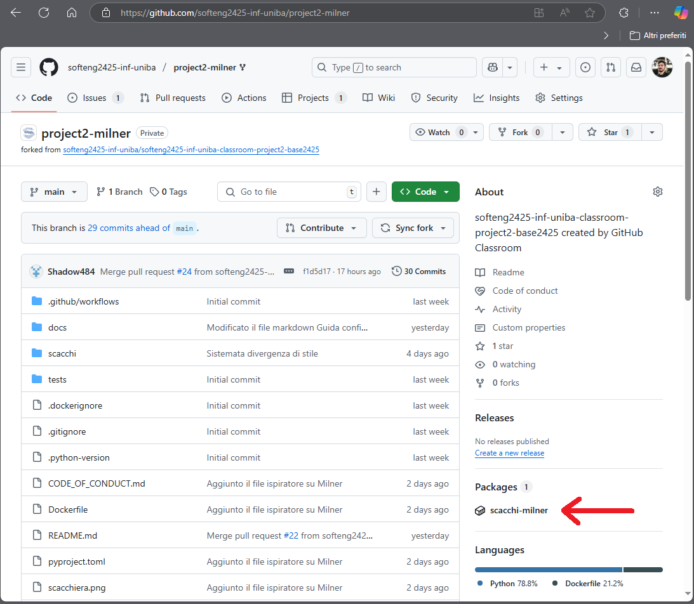
   - In caso contrario, è necessario procedere con un'associazione manuale. Per farlo:
     -  visitare la [pagina con l'elenco dei package associati all'organizzazione del corso](https://github.com/orgs/softeng2425-inf-uniba/packages).
     -  Cercare il package con il nome del proprio team e fare click sul titolo per entrare nella pagina dedicata.
     -  Scorrere in basso nella pagina e fare click sul bottone "Connect Repository".
     -  Nella finestra di dialogo, cercare e selezionare il vostro repository.
     -  Concludere l'operazione cliccando sul bottone "Connect Repository". A questo punto, tornando nella pagina principale del vostro repository, dovreste vedere il link al package nella barra laterale destra.
1. Fare click sul link al package per entrare nella pagina dedicata, quindi cliccare sul link "Package settings", presente nella barra laterale destra (vedi freccia rossa in figura). 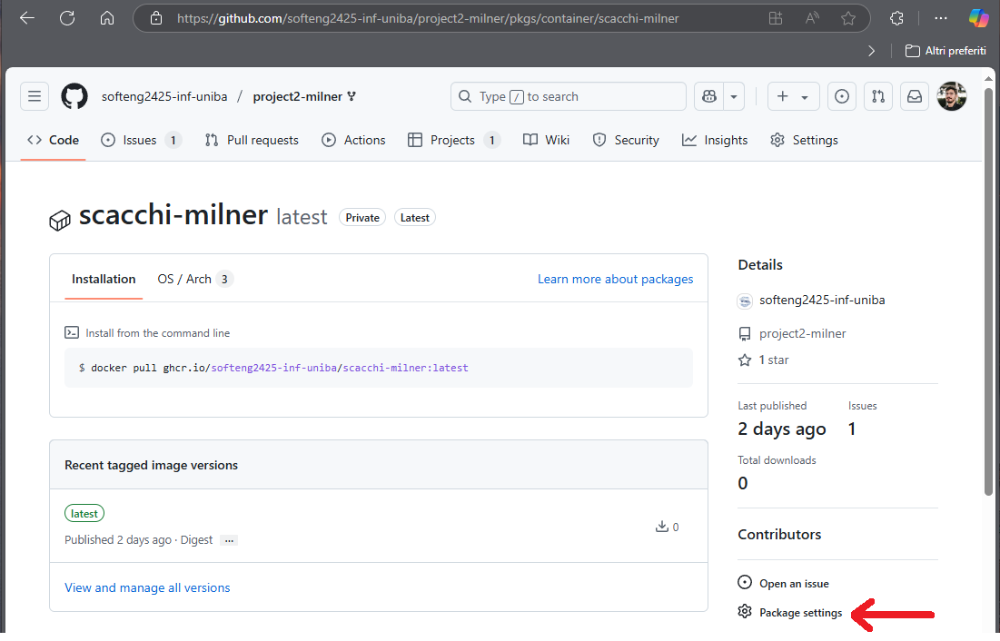
2. Scorrere in basso, sino all'intestazione "Inherited access"; rimuovere la spunta dalla checkbox *"Inherit access from source repository (recommended)"* – questa operazione comporterà un ricaricamento automatico della pagina.
3. Dopo il ricaricamento della pagina, l'intestazione *"Inherited access"* viene sostituita dall'intestazione *"Manage access"*; a destra dell'intestazione compare inoltre il bottone *"Invite teams or people"*; fare click su tale bottone e aggiungere il proprio team alla lista dei membri, conferendo allo stesso i permessi di "Admin" (vedi freccia rossa in figura). 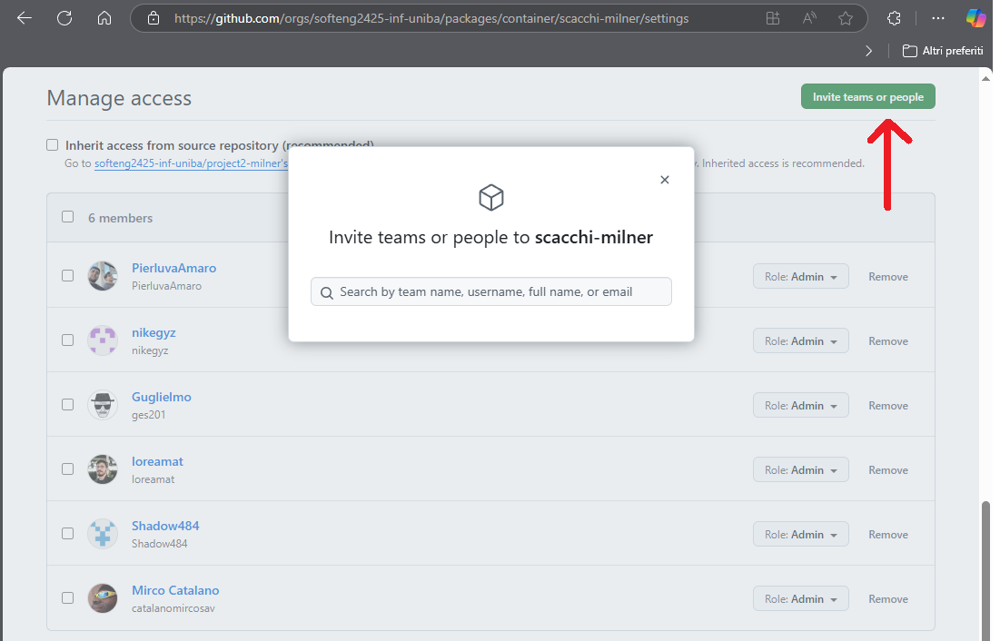

## Aggiunta del badge di GitHub Actions nel README

Per aggiungere il badge che riporta l'ultimo esito dell'esecuzione del workflow `docker_build&push.yml` (stato del workflow) all'interno del file README del vostro repository, seguire le seguenti istruzioni:

- entrare nella pagina principale del repository e cliccare su `Actions` (subito sotto il titolo, in alto al centro);

- la pagina *"All workflows"* sotto la tab *"Actions"*, riporta l'elenco delle esecuzioni (*run*) di tutti i workflow di GitHub Actions attivabili nel repository; per filtrarne il contenuto e visualizzare soltanto le esecuzioni relative al workflow `docker_build&push.yml`, fare click sulla voce corrispondente nel pannello laterale a sinistra. (**N.B.**: all'inizio del progetto, è del tutto normale che queste liste siano vuote; come già detto, il workflow `docker_build&push.yml` si attiverà per la prima volta quando modificherete il codice nelle cartelle `scacchi/` o `tests/` ed effettuerete Pull Request o operazioni di push/merge sul branch `main`);
- Una volta selezionato il workflow `docker_build&push.yml` dal pannello laterale, in alto a destra nella pagina – di fianco alla text box con la scritta "Filter workflow runs" – comparirà un nuovo bottone con tre puntini `•••`. Fare click su tale bottone e poi selezionare la voce "Create status badge" nel menù a tendina.
- Lasciando invariate le impostazioni di default (`branch` e `event`) nella finestra a comparsa, fare click su `Copy status badge Markdown`;
  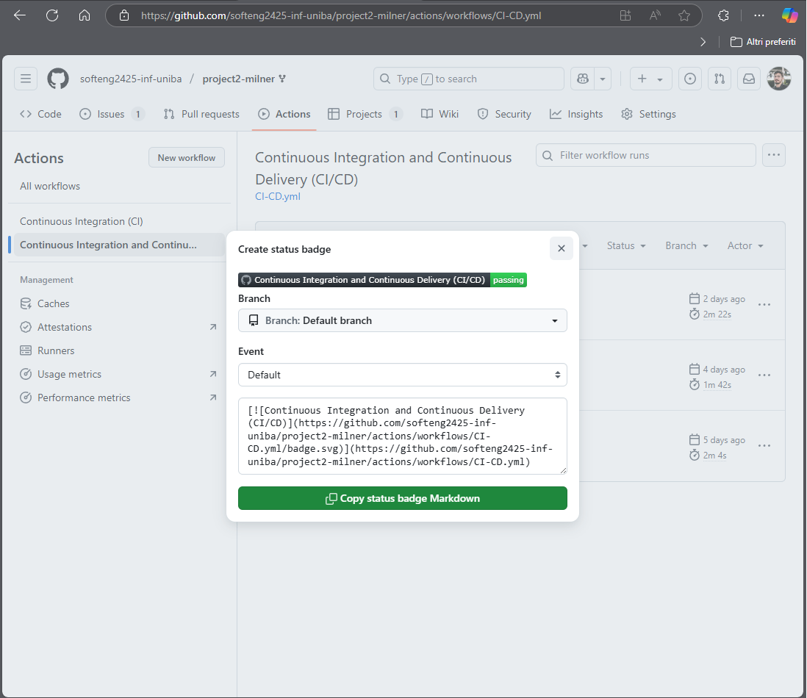
- La modifica del file Markdown `README.md` sarà fatta come parte dei task dello *Sprint 0* incollando il codice markdown per la costruzione del badge in cima al `README.md`, accanto al titolo del repository.

Il titolo del README.md apparirà come nella seguente figura:

Il colore e lo stato del badge potranno cambiare dopo ogni build, riflettendo lo stato del progetto.

