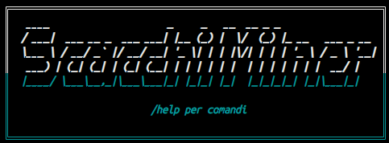
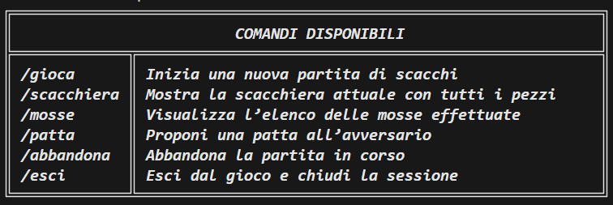
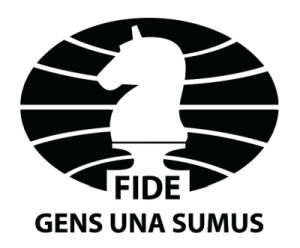

# Manuale Utente - Scacchi da Terminale

## Indice
- [Introduzione](#introduzione)
- [Regolamento](#regolamento-degli-scacchi)
- [Notazione Algebrica](#notazione-algebrica)
  - [Concetti Base](#concetti-base)
  - [Esempi di Mosse](#esempi-di-mosse)
- [Meccaniche di gioco](#meccaniche-di-gioco)
  - [Movimento dei Pezzi](#movimento-dei-pezzi)
  - [Condizioni Speciali](#condizioni-speciali)
- [Comandi e Interfaccia da Terminale](#comandi-di-gioco)
- [Requisiti di sistema](#requisiti-di-sistema)
- [Riferimenti](#riferimenti-e-crediti)

---

## Introduzione
In questa sezione si fornisce una panoramica sul gioco degli scacchi, specificando lo scopo del manuale e come utilizzare il gioco da terminale che permette a **due giocatori** di affrontarsi a turni.

[Torna al menu](#indice)

---

## Regolamento degli scacchi
Il regolamento degli scacchi stabilisce le basi per una partita equa e strutturata, definendo i movimenti dei pezzi, la disposizione iniziale sulla scacchiera e le regole speciali. 
Queste norme non solo garantiscono il corretto svolgimento dell'incontro, ma offrono anche un quadro che arricchisce la strategia di ogni giocatore. Per maggiori dettagli e per consultare il regolamento completo, puoi fare riferimento al seguente documento: **[Regolamento ufficiale FIDE](https://www.arbitriscacchi.com/up_file/439-Laws_of_Chess_Italiano.pdf)**.

[Torna al menu](#indice)

---

## Notazione Algebrica

### Concetti Base
La notazione algebrica è il metodo usato dalla maggior parte dei giocatori, delle organizzazioni, delle riviste e dei libri di scacchi per registrare e descrivere le partite; è l'unico sistema ammesso dalla FIDE per la registrazione delle mosse da parte dei giocatori. Viene usata anche per registrare le partite in formato elettronico, all'interno della notazione Portable Game.
Per ulteriori approfondimenti: **[Notazione algebrica](https://it.wikipedia.org/wiki/Notazione_algebrica)**

#### Lettere dei pezzi:
- R → Re 
- D → Regina 
- T → Torre 
- A → Alfiere 
- C → Cavallo 
- I pedoni hanno la lettera P assegnata di default; si identificano solo con la colonna di destinazione, ma si può comunque specificare la lettera di appartenenza.

#### Movimento e cattura:
- x → Indica una cattura.
- O-O → Arrocco corto (il re si sposta due caselle e la torre salta accanto).
- O-O-O → Arrocco lungo (il re si sposta due caselle verso il lato della regina e la torre si posiziona accanto).
#### Stato del re:
- "+" → Indica uno scacco al re (es. Qh5+ mette il re avversario sotto scacco).
- "#" → Indica scacco matto (es. Qh5# significa che la regina ha dato scacco matto).
#### Altri simboli utili:
- = → Promozione di un pedone (es. e8=Q indica che il pedone in e8 si trasforma in regina).
- e.p. → Cattura "en passant", quando un pedone cattura un altro pedone che ha appena avanzato di due caselle (es. dxe6 ep).

### Esempi di Mosse
- e4
Il pedone della colonna "e" avanza di due caselle. È una delle aperture più comuni e porta al controllo del centro della scacchiera.

- Cf3
Il cavallo si sposta nella casella f3. Questo movimento sviluppa un pezzo verso il centro, preparandosi a controllare caselle chiave.

- Axe5
L’alfiere cattura un pezzo posizionato sulla casella e5. La "x" indica che c’è una cattura in corso.

- O-O
Arrocco corto (lato re): il re si sposta di due caselle verso la torre, e la torre "salta" sul lato opposto del re.

- O-O-O
Arrocco lungo (lato donna): una variante dell'arrocco in cui il re si sposta di due caselle verso la torre opposta e la torre si posiziona subito accanto al re.

- xd4
Il pedone cattura un pezzo sulla diagonale, occupando la casella d4. La "x" denota l’azione di cattura.

- Dh5+
La regina si sposta in h5 e, con il simbolo "+", indica che la mossa mette in scacco il re avversario.

[Torna al menu](#indice)

---

## Meccaniche di gioco
### Movimento dei pezzi 
**Il movimento dei pezzi è spiegato tramite le seguenti immagini animate.**
#### Pedone (♙ / ♟)
- Movimento: in avanti di 1 casa per volta (Seconda mossa).
- Alla prima mossa può avanzare di 2 case (Prima mossa).

- Cattura: in diagonale di 1 casa (non in avanti).

#### Torre (♖ / ♜)
- Movimento: in linea retta orizzontale o verticale per quante case vuole.

- Cattura: nella stessa direzione di movimento.

#### Alfiere (♗ / ♝)
- Movimento: in diagonale, per quante case vuole.

- Cattura: nella stessa direzione.

#### Cavallo (♘ / ♞)
- Movimento: a “L”: due case in una direzione (orizzontale o verticale), poi una casa perpendicolare.

- Salta eventuali pezzi intermedi.

- Cattura: nella casa di arrivo.

#### Regina (♕ / ♛)
- Movimento: unisce movimento di torre e alfiere: orizzontale, verticale, o diagonale per quante case vuole.

- Cattura: nella stessa direzione.

#### Re (♔ / ♚)
- Movimento: 1 casa in qualunque direzione.

- Cattura: nella stessa direzione

### Condizioni speciali
#### Arrocco
Coinvolge re e torre.
Il re si sposta di 2 case verso una torre, e la torre salta il re posizionandosi accanto a lui.

**Condizioni per arroccare:**

- Né il re né la torre devono essersi mossi prima.

- Nessun pezzo tra re e torre.

- Il re non può essere sotto scacco, né attraversare una casa sotto attacco.

#### En passant
Quando un pedone avversario avanza di 2 case dalla sua posizione iniziale e si posiziona accanto a un tuo pedone, puoi catturarlo come se avesse fatto solo 1 passo.

Valido solo al turno immediatamente successivo.

#### Promozione
Quando un pedone raggiunge l’ultima traversa (8ª riga per i bianchi, 1ª per i neri), viene promosso a un altro pezzo (regina, torre, alfiere, cavallo) a scelta del giocatore — quasi sempre regina.

#### Scacco e scacco matto
- Scacco: il re è sotto attacco. Devi pararlo.

- Scacco matto: il re è sotto attacco e non c'è modo legale per salvarlo. Finisce la partita.

#### Stallo 
Non è scacco matto, ma il giocatore non ha mosse legali e non è sotto scacco. La partita finisce patta (pareggio).

#### Mossa ambigua
A volte potrebbe capitare che due pezzi uguali del giocatore possano mangiare nella stessa casa. Per risolvere l'ambiguità, basta specificare la casa di partenza del pezzo (individuata da colonna) del pezzo che si vuole muovere, e continuare normalmente la cattura in notazione algebrica.

[Torna al menu](#indice)

---

## Comandi di gioco

**Con /help, --help, -h** viene mostrata una descrizione dell’applicazione seguita dall’elenco dei comandi disponibili.

- **/gioca** → Avvia una nuova partita, mostrando la scacchiera con i pezzi nella posizione iniziale e preparando la prima mossa del bianco.

 

- **/scacchiera** → Mostra la disposizione attuale dei pezzi sulla scacchiera; se la partita non è iniziata, suggerisce di usare /gioca.

- **/mosse** → Mostra la cronologia delle mosse giocate nella partita corrente, utilizzando la notazione algebrica abbreviata in italiano.

- **/patta** → Propone la patta all’avversario; se accettata, la partita termina con un pareggio, altrimenti il gioco continua.

- **/abbandona** → Permette al giocatore di abbandonare la partita; richiede conferma e, in caso positivo, dichiara la vittoria dell’avversario.

- **/esci** → Permette di chiudere l’applicazione; richiede conferma e, in caso positivo, termina il gioco restituendo il controllo al sistema operativo.

[Torna al menu](#indice)

---

## Requisiti di sistema 
1. **L'applicazione deve essere eseguita all'interno di un container Docker.** 

2. **L'applicazione è compatibile con i seguenti terminali:**
-  Terminal di Linux
-  Terminal di macOS
-  PowerShell di Windows
-  Git Bash di Windows
3. **L'applicazione utilizza i simboli UTF-8 per la rappresentazione grafica dei pezzi degli scacchi:**
♔ ♕ ♖ ♗ ♘ ♙ | ♚ ♛ ♜ ♝ ♞ ♟

[Torna al menu](#indice)

---

## Riferimenti e Crediti

### FIDE

La Federazione internazionale degli scacchi, nota con l'acronimo francese [FIDE](https://it.wikipedia.org/wiki/Federazione_Internazionale_degli_Scacchi) (Fédération internationale des échecs), è un'organizzazione internazionale che regolamenta e controlla l'attività scacchistica a livello mondiale.

[Torna al menu](#indice)

---