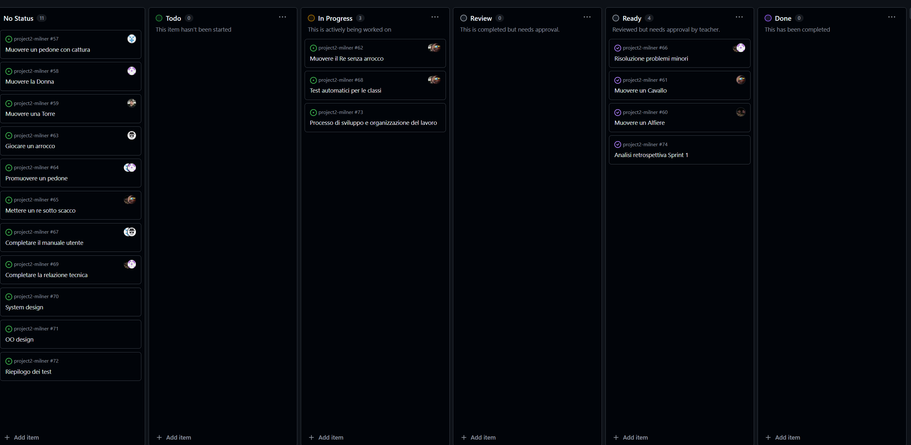
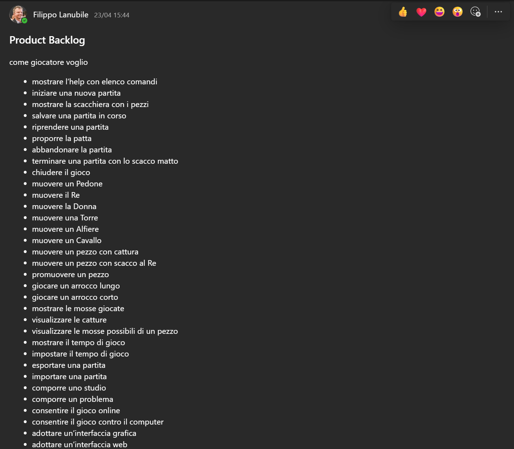
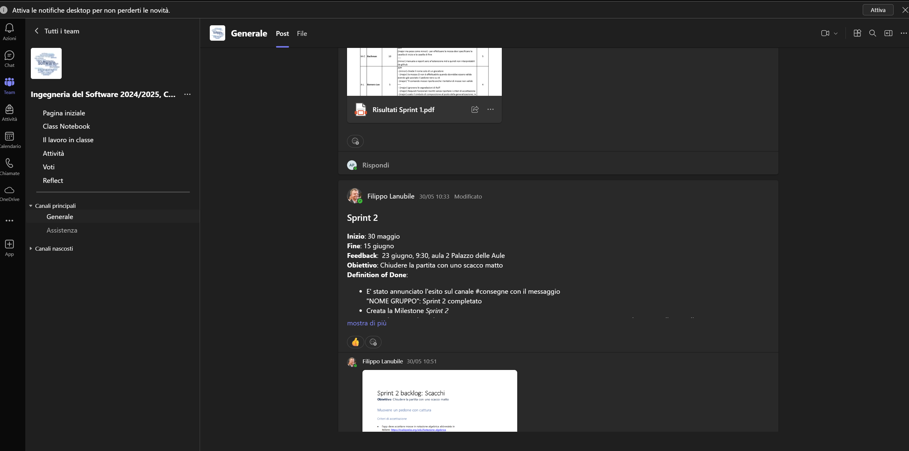
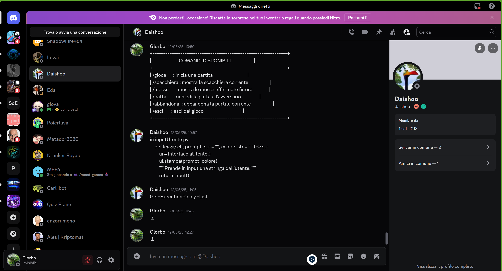
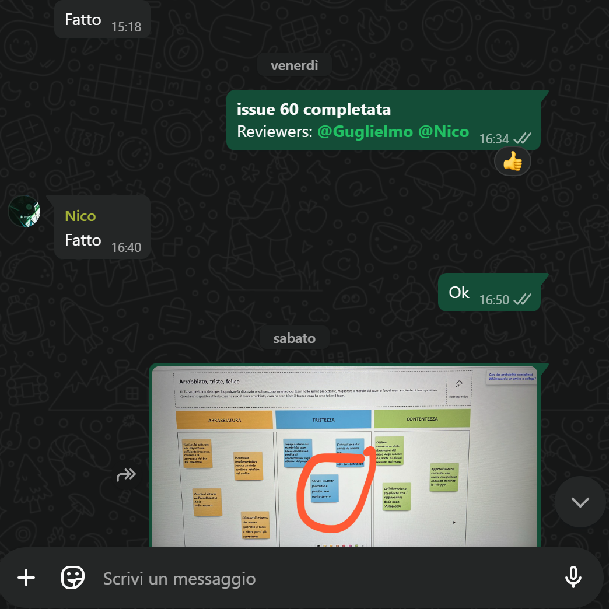
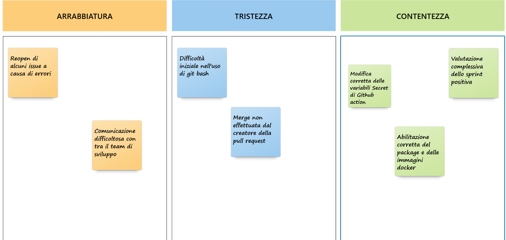
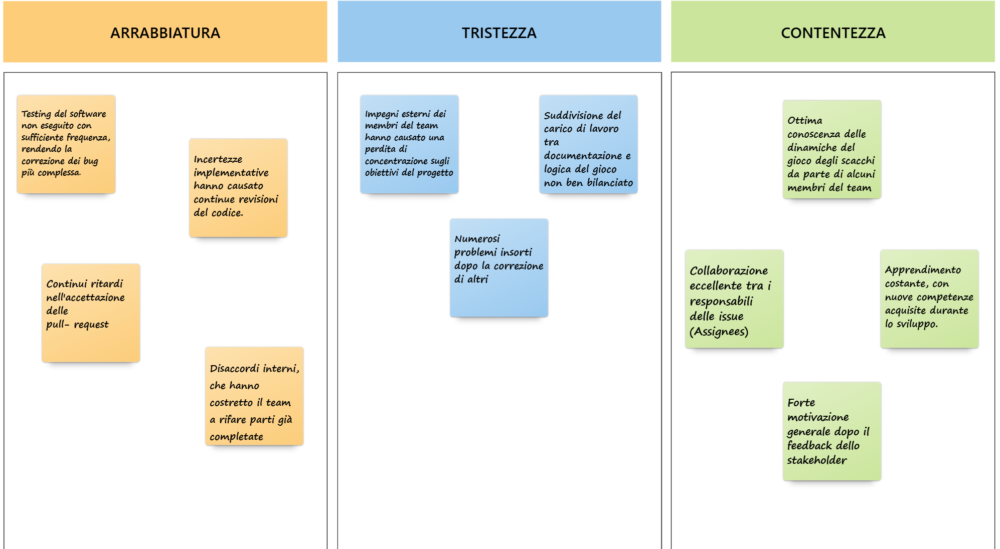

## RELAZIONE TECNICA DEL PROGETTO SCACCHI

## Indice
1. [Introduzione](#introduzione)
2. [Modello di dominio](#modello-di-dominio)
3. [Requisiti specifici](#requisiti-specifici)
   - [Requisiti funzionali](#requisiti-funzionali)
   - [Requisiti non funzionali](#requisiti-non-funzionali)
4. [Processo di sviluppo e organizzazione del lavoro](#processo-di-sviluppo-e-organizzazione-del-lavoro)
5. [Analisi retrospettiva](#analisi-retrospettiva)
   - [Sprint 0](#sprint-0)
   - [Sprint 1](#sprint-1)

## Introduzione
Questo progetto implementa una versione testuale del gioco degli **scacchi** utilizzando **Python**, giocabile direttamente da terminale. Due giocatori si alternano in locale, effettuando le loro mosse attraverso comandi testuali, rispettando le regole ufficiali degli scacchi.

L'obiettivo principale è offrire un'esperienza **interattiva**, senza interfaccia grafica, permettendo di sviluppare **competenze di programmazione** e confidenza con gli **ambienti di sviluppo**. Inoltre, il progetto è pensato per introdurre i concetti di **controllo versione** tramite **GitHub**, facilitando la gestione collaborativa del codice.

#### Caratteristiche principali
- **Gioco a turni** tra due giocatori in locale.
- **Validazione delle mosse** secondo le regole degli scacchi.
- **Interfaccia testuale** con input utente.
- **Gestione di scacco, scacco matto e patta**.
- **Utilizzo di GitHub** per versionamento e collaborazione.

#### Obiettivi
Questo progetto mira a:
- Applicare concetti di **programmazione Python**, gestione degli input e strutture dati.
- Approfondire l’uso di **GitHub**, imparando a versionare il codice e collaborare su repository.
- Sviluppare logica e algoritmi legati al **movimento dei pezzi** e alla gestione del gioco.

#### Tecnologie Utilizzate
- **Python** (logica di gioco e interfaccia testuale)
- **Git/GitHub** (gestione della versione del codice e collaborazione)

#### Riferimenti al team
Il progetto è realizzato grazie alla collaborazione dei membri del team "Milner": 
- [Amato Pierluca](https://github.com/PierluvaAmaro)
- [Catalano Mirco Saverio](https://github.com/catalanomircosav)
- [Nicolò de Bari](https://github.com/nikegyz)
- [Amorosini Antonio](https://github.com/Shadow484)
- [Gesmundo Guglielmo](https://github.com/Ges201)
- [Amato Lorenzo](https://github.com/loreamat)

[Torna al menu](#indice)

---

## Modello di dominio
#### Che cosa è?
Un diagramma delle classi è una rappresentazione grafica utilizzata nella programmazione orientata agli oggetti per mostrare la struttura di un sistema.
 È uno strumento fondamentale per modellare il software, facilitando la comprensione del design e supportando la fase di sviluppo.

#### Modello del progetto

[Torna al menu](#indice)

---

## Requisiti specifici
#### Requisiti funzionali

**RF1 – Visualizzazione dell'help**

Il sistema deve mostrare una descrizione concisa dell'applicazione seguita dall’elenco dei comandi disponibili, uno per riga, quando l’utente invoca uno dei seguenti comandi:
- `/help`
- `--help`
- `-h`

**RF2 – Avvio di una nuova partita**

Il sistema deve permettere di iniziare una nuova partita al comando `/gioca`, se non è già in corso una partita.

All’invocazione, l’applicazione deve:
- mostrare la scacchiera con i pezzi nella posizione iniziale;
- predisporre l'interfaccia per ricevere la prima mossa del bianco o altri comandi.

**RF3 – Visualizzazione della scacchiera**

Il sistema deve rispondere al comando `/scacchiera` con due comportamenti distinti:
- se il gioco **non è iniziato**, suggerisce l’uso del comando `/gioca`;
- se il gioco **è in corso**, mostra la posizione attuale di tutti i pezzi sulla scacchiera.

**RF4 – Abbandono della partita**

Il sistema deve permettere al giocatore di abbandonare la partita tramite il comando `/abbandona`.

Il comportamento deve essere il seguente:
- l’applicazione chiede conferma all’utente;
- se la conferma è **positiva**, comunica che l’avversario ha vinto per abbandono;
- se la conferma è **negativa**, resta in attesa di altri comandi o tentativi.

**RF5 – Proposta di patta**

Il sistema deve permettere al giocatore di proporre la patta tramite il comando `/patta`.

Il comportamento deve essere il seguente:
- l’app chiede conferma all’avversario;
- se l’avversario accetta, la partita termina in pareggio;
- se l’avversario rifiuta, il sistema si predispone a ricevere altri comandi.

**RF6 – Chiusura dell'applicazione**

Il sistema deve gestire la chiusura dell’applicazione tramite il comando `/esci`.

Il comportamento deve essere il seguente:
- l’applicazione chiede conferma;
- se la conferma è **positiva**, si chiude e restituisce il controllo al sistema operativo;
- se la conferma è **negativa**, si predispone a ricevere nuovi comandi.

**RF7 - Visualizzazione delle mosse**

Il sistema deve rispondere al comando `/mosse` mostrando la **cronologia delle mosse** effettuate nella partita in corso, utilizzando la **notazione algebrica abbreviata in italiano**.

Esempio di output atteso:
e4 c6
d4 d5
Cc3 dxe4
Cxe4 Cd7
De2 Cgf6

Il formato deve essere leggibile e coerente con la notazione standard, per permettere ai giocatori di consultare facilmente lo storico delle mosse e analizzare l'andamento della partita.

[Torna al menu](#indice)

---

#### Requisiti non funzionali
- **RNF1**: L'applicazione deve essere eseguita all'interno di un container Docker.
- **RNF2**: L'applicazione deve essere compatibile con i seguenti terminali:
  - Terminal di Linux
  - Terminal di macOS
  - PowerShell di Windows
  - Git Bash di Windows
- **RNF3**: L'applicazione deve utilizzare i simboli UTF-8 per la rappresentazione grafica dei pezzi degli scacchi: ♔ ♕ ♖ ♗ ♘ ♙ ♚ ♛ ♜ ♝ ♞ ♟.
  (Riferimento: [Wikipedia - Scacchi](https://it.wikipedia.org/wiki/Scacchi#Descrizione_e_regolamento))

[Torna al menu](#indice)

---

## Processo di sviluppo e organizzazione del lavoro

### Metodologia di sviluppo
Per la gestione del progetto abbiamo scelto di adottare il framework Scrum, uno dei metodi più diffusi all'interno dell’approccio Agile. Questa scelta è stata motivata dall’esigenza di lavorare in modo collaborativo, iterativo e adattivo, elementi fondamentali per affrontare un progetto dinamico come lo sviluppo di un’applicazione scacchistica.

Scrum si basa su cicli di lavoro brevi e regolari chiamati sprint, ognuno dei quali rappresenta un periodo di tempo fisso (nel nostro caso, circa 2 settimane) in cui il team si concentra sul completamento di un insieme specifico di funzionalità. L’obiettivo è produrre a ogni sprint un incremento di prodotto funzionante, che possa essere presentato allo stakeholder per ricevere un feedback.

| Nome             | Ruolo        | Compiti principali                                     |
| ---------------- | ------------ | ------------------------------------------------------ |
| Prof. Lanubile Filippo | Stakeholder  | Requisiti, feedback, validazione del prodotto          |
| Mirco Catalano   | Scrum Master | Facilitazione, supporto al team, gestione del processo |
| Pierluca Amato        | Developer    | Sviluppo funzionalità, testing, collaborazione  |
| Nicolò de Bari        | Developer    | Sviluppo funzionalità, testing, collaborazione               |
| Lorenzo Amato        | Developer    | Sviluppo funzionalità, testing, collaborazione        |
| Antonio Amorosini        | Developer    | Sviluppo funzionalità, testing, collaborazione                  |
| Guglielmo Gesmundo      | Developer    | Sviluppo funzionalità, testing, collaborazione                       |

Durante ogni Sprint, sia durante le lezioni in aula che tramite Microsoft Teams, ci sono stati comunicati i requisiti da parte dello stakeholder. Questi requisiti sono stati espressi sotto forma di **User Story**, ciascuna accompagnata da una relativa **Definition of Done**(DoD), ovvero l’insieme dei criteri che ne determinano il completamento accettabile.

A partire dallo Sprint 0, il team ha organizzato il lavoro creando una Board dedicata per ciascuno Sprint, per rappresentare visivamente lo stato di avanzamento delle attività, attraverso colonne come To Do, In Progress, Review, Ready e Done.

Parallelamente, è stato creato un **Product Backlog**, aggiornato progressivamente, che contiene tutte le User Story previste per gli Sprint successivi. Questo backlog funge da punto di riferimento centrale per la pianificazione e la gestione delle priorità, permettendo al team di avere una visione d'insieme del progetto e di adattarsi rapidamente ai cambiamenti o ai nuovi requisiti che emergono nel corso dello sviluppo.

## Organizzazione sprint
Il lavoro è stato suddiviso in tre Sprint principali, ognuno con una durata prestabilita e un obiettivo chiaro da raggiungere.
| Sprint   | Periodo                  | Obiettivo principale                                                                                   |
| -------- | ------------------------ | ------------------------------------------------------------------------------------------------------ |
| Sprint 0 | 28 Marzo – 10 Aprile     | Familiarizzare con il **processo Agile**, Git e **GitHub Flow**.                                       |
| Sprint 1 | 28/29 Aprile – 15 Maggio | Sviluppo dell’**MVP** con implementazione della **fase d'apertura** e movimento dei **pedoni**.        |
| Sprint 2 | 30 Maggio – 15 Giugno    | Completamento delle regole di gioco e implementazione della **condizione di vittoria (scacco matto)**. |

Ogni Sprint ha seguito il ciclo Scrum completo, comprendente:

- Sprint Planning: definizione degli obiettivi e delle User Story da realizzare.

- Daily Scrum: breve riunione quotidiana per condividere stato, ostacoli e piani.

- Sprint Review: presentazione dell'incremento realizzato allo stakeholder e conseguente feedback.

- Sprint Retrospective: riflessione interna sul processo e sulle modalità di lavoro.

## Software utilizzati
Nel corso dello sviluppo del progetto, il team ha fatto uso di diversi strumenti software, scelti in funzione delle esigenze organizzative, comunicative e tecniche del gruppo. Questi strumenti hanno facilitato la collaborazione a distanza, la scrittura del codice in modo condiviso e la gestione efficiente dell’intero flusso di lavoro.
### Software di organizzazione e comunicazione
- **Microsoft Teams** 
Utilizzato per comunicare con lo stakeholder (il professore), ricevere indicazioni sugli Sprint, partecipare a meeting ufficiali e condividere materiali formali.

- **Discord** 
Canale principale di comunicazione interna del team. Usato quotidianamente per discutere, organizzare il lavoro e svolgere i Daily Scrum. Ha facilitato lo sviluppo in tempo reale con condivisione schermo e vocali.

- **WhatsApp**  
Utilizzato per comunicazioni rapide e informali, soprattutto fuori dall’orario di lavoro, utile per coordinamenti veloci e promemoria.

### Software tecnico
- **Visual Studio Code** 
Editor di codice sorgente leggero, open-source e multipiattaforma, sviluppato da Microsoft. È stato lo strumento principale utilizzato dal team per scrivere, modificare e gestire il codice del progetto.

  - **Visual Studio Code (Live Share)** 
  Estensione di VS Code che ha permesso la programmazione simultanea tra più membri del team, facilitando la collaborazione diretta sul codice.

- **GitHub** 
Piattaforma per la gestione del controllo versione, seguendo il flusso GitHub Flow. Ha ospitato il repository del progetto e gestito i vari branch funzionali.

- **Pytest**  
Framework per l'esecuzione dei test automatici sul codice Python, utilizzato per verificare il corretto funzionamento delle funzionalità implementate.

- **Ruff** 
Strumento di linting per Python, utile per mantenere il codice coerente, leggibile e conforme agli standard stilistici.

- **Docker** 
Utilizzato per eseguire l'applicazione in un ambiente isolato e replicabile, garantendo portabilità e coerenza tra i vari ambienti di sviluppo.

---

## Analisi retrospettiva
### Sprint 0
L'immagine rappresenta il risultato del team meeting svolto dopo lo Sprint 0, durante il quale abbiamo riflettuto sulle difficoltà incontrate e sulle soluzioni adottate. 

### Cosa è emerso?
Alcune difficoltà tecniche, come l'uso di Git Bash, hanno inizialmente rallentato il lavoro.
Alcune pull request non sono state correttamente mergeate dal loro creatore, causando ritardi.
La comunicazione interna ha generato alcune incomprensioni nel team.
### Soluzioni implementate
- Difficoltà d'uso di Git Bash → Risolta con la pratica e con il supporto tra i membri del team.
- Merge non effettuato dal creatore della pull request → Errore riconosciuto e discusso, con un processo più chiaro da seguire.
- Comunicazione errata nel gruppo → Migliorata grazie alla partecipazione a meeting costanti per allineare tutti i membri.

Il confronto è stato utile per identificare le aree di miglioramento e definire soluzioni concrete per gli sprint futuri.

### Sprint 1
L'immagine rappresenta il risultato del team meeting svolto dopo lo Sprint 1, durante il quale abbiamo riflettuto sulle difficoltà incontrate e sulle soluzioni adottate.

### Cosa è emerso?
Nel primo sprint del progetto software per scacchi, il team ha affrontato diverse sfide che hanno rallentato lo sviluppo. Problemi nel testing hanno causato ritardi nella correzione dei bug, mentre incertezze implementative hanno richiesto continue revisioni del codice, generando frustrazione. Disaccordi interni e ritardi nelle pull-request hanno influito negativamente sulla coesione e sulla produttività. Inoltre, la gestione poco equilibrata del carico di lavoro e gli impegni esterni dei membri del team hanno compromesso la concentrazione sugli obiettivi. Infine, la comparsa di nuovi problemi dopo ogni correzione ha creato un ciclo continuo di debugging, aggiungendo ulteriore stress allo sviluppo.

### Soluzioni implementate
- Ritardi nell’accettazione delle pull-request → Creazione di un documento condiviso con scadenze prefissate.
- Nuovi problemi dopo ogni correzione → Applicazione di strategie di testing regressivo (selettivo) per verificare che le modifiche non generino ulteriori bug
- Impegni esterni dei membri del team → Revisione della flessibilità degli obiettivi in base a ciascun membro del team. 
- Squilibri tra documentazione e logica di gioco → Maggiore attenzione all'assegnazione degli issue tramite sondaggi nei canali di comunicazione del team (per eventuali preferenze). 
- Disaccordi interni → Meeting di coordinamento in presenza dello scrum-master.

Abbiamo completato il primo sprint con determinazione, affrontando sfide e migliorando il nostro approccio. Ogni difficoltà superata è stata una lezione preziosa, e ogni progresso ci avvicina alla visione finale del progetto.

[Torna al menu](#indice)

---

