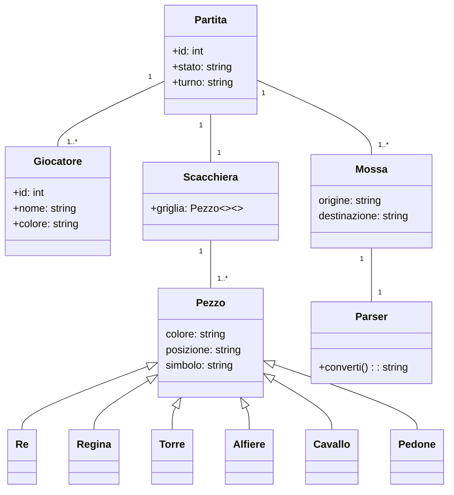

## RELAZIONE TECNICA DEL PROGETTO SCACCHI

[//]: # (Struttura indice)
## Indice
1. [Introduzione](#introduzione)
2. [Modello di dominio](#modello-di-dominio)
3. [Requisiti specifici](#requisiti-specifici)
   - [Requisiti funzionali](#requisiti-funzionali)
   - [Requisiti non funzionali](#requisiti-non-funzionali)
4. [Analisi retrospettiva](#analisi-retrospettiva)
   - [Sprint 0](#sprint-0)

## Introduzione
[//]: # (Implementazione dell'introduzione)
Questo progetto implementa una versione testuale del gioco degli **scacchi** utilizzando **Python**, giocabile direttamente da terminale. Due giocatori si alternano in locale, effettuando le loro mosse attraverso comandi testuali, rispettando le regole ufficiali degli scacchi.

L'obiettivo principale è offrire un'esperienza **interattiva**, senza interfaccia grafica, permettendo di sviluppare **competenze di programmazione** e confidenza con gli **ambienti di sviluppo**. Inoltre, il progetto è pensato per introdurre i concetti di **controllo versione** tramite **GitHub**, facilitando la gestione collaborativa del codice.

#### Caratteristiche principali
- **Gioco a turni** tra due giocatori in locale.
- **Validazione delle mosse** secondo le regole degli scacchi.
- **Interfaccia testuale** con input utente.
- **Gestione di scacco, scacco matto e patta**.
- **Utilizzo di GitHub** per versionamento e collaborazione.

#### Obiettivi
Questo progetto mira a:
- Applicare concetti di **programmazione Python**, gestione degli input e strutture dati.
- Approfondire l’uso di **GitHub**, imparando a versionare il codice e collaborare su repository.
- Sviluppare logica e algoritmi legati al **movimento dei pezzi** e alla gestione del gioco.

#### Tecnologie Utilizzate
- **Python** (logica di gioco e interfaccia testuale)
- **Git/GitHub** (gestione della versione del codice e collaborazione)

#### Riferimenti al team
Il progetto è realizzato grazie alla collaborazione dei membri del team "Milner": 
- [Amato Pierluca](https://github.com/PierluvaAmaro)
- [Catalano Mirco Saverio](https://github.com/catalanomircosav)
- [Nicola de Bari](https://github.com/nikegyz)
- [Amorosini Antonio](https://github.com/Shadow484)
- [Gesmundo Guglielmo](https://github.com/Ges201)
- [Amato Lorenzo](https://github.com/loreamat)

---

## Modello di dominio
[//]: # (Implementazione del modello di dominio)
#### Che cosa è?
Un diagramma delle classi è una rappresentazione grafica utilizzata nella programmazione orientata agli oggetti per mostrare la struttura di un sistema.
 È uno strumento fondamentale per modellare il software, facilitando la comprensione del design e supportando la fase di sviluppo.

Ci sono diversi modi per rappresentare un diagramma delle classi, a seconda dello strumento e dello stile utilizzato. In questo progetto viene utilizzato il linguaggio di markup [Mermaid](https://docs.github.com/en/get-started/writing-on-github/working-with-advanced-formatting/creating-diagrams) per creare diagrammi direttamente in file Markdown.

---

## Requisiti specifici
### Requisiti funzionali
[//]: # (Implementazione dei requisiti funzionali)

---

### Requisiti non funzionali
[//]: # (Implementazione dei requisiti non funzionali)

---

## Analisi retrospettiva
### Sprint 0
[//]: # (Implementazione dell'AR relativa allo sprint 0)

---

