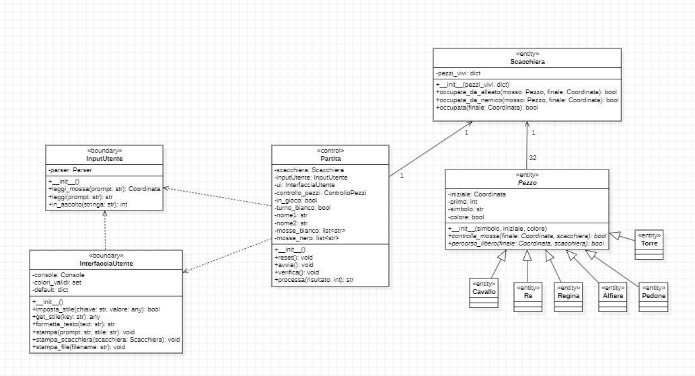

## RELAZIONE TECNICA DEL PROGETTO SCACCHI

## Indice
1. [Introduzione](#introduzione)
2. [Modello di dominio](#modello-di-dominio)
3. [Requisiti specifici](#requisiti-specifici)
   - [Requisiti funzionali](#requisiti-funzionali)
   - [Requisiti non funzionali](#requisiti-non-funzionali)
4. [System design](#system-design)
   - [Diagramma dei pacchetti](#diagramma-dei-pacchetti)
   - [Principi di progettazione](#principi-di-progettazione-utilizzati)
   - [Motivazione delle scelte progettuali](#motivazione-delle-scelte-progettuali)
5. [Object Oriented Design](#object-oriented-design)
   - [Diagrammi di classi e sequenza](#diagrammi-di-classe-e-di-sequenza)
   - [principi di OO Design](#principi-di-object-oriented-desing)
6. [Riepilogo dei test](#riepilogo-dei-test)
   - [Introduzione ai test](#introduzione-ai-test)
   - [Criteri utilizzati](#criteri-utilizzati)
   - [Struttura](#struttura)
   - [Esito](#esito)
7. [Processo di sviluppo e organizzazione del lavoro](#processo-di-sviluppo-e-organizzazione-del-lavoro)
   - [Metodologia di sviluppo](#metodologia-di-sviluppo)
   - [Organizzazione sprint](#organizzazione-sprint)
   - [Software utilizzati](#software-utilizzati)
8. [Analisi retrospettiva](#analisi-retrospettiva)
   - [Sprint 0](#sprint-0)
   - [Sprint 1](#sprint-1)

## Introduzione
Questo progetto implementa una versione testuale del gioco degli **scacchi** utilizzando **Python**, giocabile direttamente da terminale. Due giocatori si alternano in locale, effettuando le loro mosse attraverso comandi testuali, rispettando le regole ufficiali degli scacchi.

L'obiettivo principale è offrire un'esperienza **interattiva**, senza interfaccia grafica, permettendo di sviluppare **competenze di programmazione** e confidenza con gli **ambienti di sviluppo**. Inoltre, il progetto è pensato per introdurre i concetti di **controllo versione** tramite **GitHub**, facilitando la gestione collaborativa del codice.

#### Caratteristiche principali
- **Gioco a turni** tra due giocatori in locale.
- **Validazione delle mosse** secondo le regole degli scacchi.
- **Interfaccia testuale** con input utente.
- **Gestione di scacco, scacco matto e patta**.
- **Utilizzo di GitHub** per versionamento e collaborazione.

#### Obiettivi
Questo progetto mira a:
- Applicare concetti di **programmazione Python**, gestione degli input e strutture dati.
- Approfondire l’uso di **GitHub**, imparando a versionare il codice e collaborare su repository.
- Sviluppare logica e algoritmi legati al **movimento dei pezzi** e alla gestione del gioco.

#### Tecnologie Utilizzate
- **Python** (logica di gioco e interfaccia testuale)
- **Git/GitHub** (gestione della versione del codice e collaborazione)

#### Riferimenti al team
Il progetto è realizzato grazie alla collaborazione dei membri del team "Milner": 
- [Amato Pierluca](https://github.com/PierluvaAmaro)
- [Catalano Mirco Saverio](https://github.com/catalanomircosav)
- [Nicolò de Bari](https://github.com/nikegyz)
- [Amorosini Antonio](https://github.com/Shadow484)
- [Gesmundo Guglielmo](https://github.com/Ges201)
- [Amato Lorenzo](https://github.com/loreamat)

[Torna al menu](#indice)

---

## Modello di dominio
#### Che cosa è?
Un diagramma delle classi è una rappresentazione grafica utilizzata nella programmazione orientata agli oggetti per mostrare la struttura di un sistema.
 È uno strumento fondamentale per modellare il software, facilitando la comprensione del design e supportando la fase di sviluppo.

#### Modello del progetto

[Torna al menu](#indice)

---

## Requisiti specifici
#### Requisiti funzionali

**RF1 – Visualizzazione dell'help**

Il sistema deve mostrare una descrizione concisa dell'applicazione seguita dall’elenco dei comandi disponibili, uno per riga, quando l’utente invoca uno dei seguenti comandi:
- `/help`
- `--help`
- `-h`

**RF2 – Avvio di una nuova partita**

Il sistema deve permettere di iniziare una nuova partita al comando `/gioca`, se non è già in corso una partita.

All’invocazione, l’applicazione deve:
- mostrare la scacchiera con i pezzi nella posizione iniziale;
- predisporre l'interfaccia per ricevere la prima mossa del bianco o altri comandi.

**RF3 – Visualizzazione della scacchiera**

Il sistema deve rispondere al comando `/scacchiera` con due comportamenti distinti:
- se il gioco **non è iniziato**, suggerisce l’uso del comando `/gioca`;
- se il gioco **è in corso**, mostra la posizione attuale di tutti i pezzi sulla scacchiera.

**RF4 – Abbandono della partita**

Il sistema deve permettere al giocatore di abbandonare la partita tramite il comando `/abbandona`.

Il comportamento deve essere il seguente:
- l’applicazione chiede conferma all’utente;
- se la conferma è **positiva**, comunica che l’avversario ha vinto per abbandono;
- se la conferma è **negativa**, resta in attesa di altri comandi o tentativi.

**RF5 – Proposta di patta**

Il sistema deve permettere al giocatore di proporre la patta tramite il comando `/patta`.

Il comportamento deve essere il seguente:
- l’app chiede conferma all’avversario;
- se l’avversario accetta, la partita termina in pareggio;
- se l’avversario rifiuta, il sistema si predispone a ricevere altri comandi.

**RF6 – Chiusura dell'applicazione**

Il sistema deve gestire la chiusura dell’applicazione tramite il comando `/esci`.

Il comportamento deve essere il seguente:
- l’applicazione chiede conferma;
- se la conferma è **positiva**, si chiude e restituisce il controllo al sistema operativo;
- se la conferma è **negativa**, si predispone a ricevere nuovi comandi.

**RF7 - Visualizzazione delle mosse**

Il sistema deve rispondere al comando `/mosse` mostrando la **cronologia delle mosse** effettuate nella partita in corso, utilizzando la **notazione algebrica abbreviata in italiano**.

Esempio di output atteso:
e4 c6
d4 d5
Cc3 dxe4
Cxe4 Cd7
De2 Cgf6

Il formato deve essere leggibile e coerente con la notazione standard, per permettere ai giocatori di consultare facilmente lo storico delle mosse e analizzare l'andamento della partita.

#### Requisiti non funzionali
- **RNF1**: L'applicazione deve essere eseguita all'interno di un container Docker.
- **RNF2**: L'applicazione deve essere compatibile con i seguenti terminali:
  - Terminal di Linux
  - Terminal di macOS
  - PowerShell di Windows
  - Git Bash di Windows
- **RNF3**: L'applicazione deve utilizzare i simboli UTF-8 per la rappresentazione grafica dei pezzi degli scacchi: ♔ ♕ ♖ ♗ ♘ ♙ ♚ ♛ ♜ ♝ ♞ ♟.
  (Riferimento: [Wikipedia - Scacchi](https://it.wikipedia.org/wiki/Scacchi#Descrizione_e_regolamento))

[Torna al menu](#indice)

---

## System Design
### Diagramma dei pacchetti
Un diagramma dei pacchetti in UML è un tipo di diagramma strutturale usato per:

- Organizzare in modo gerarchico e modulare elementi come classi, componenti,   casi d’uso, pacchetti stessi, ecc. 

- Rappresentare dipendenze tra questi moduli, mediante frecce tratteggiate che simboleggiano relazioni

(**Diagramma dei pacchetti del software**): 

| Package   | Classe/Modulo                | Funzione                                                       |
|-----------|-----------------------------|-----------------------------------------------------------------|
| Entity    | Coordinata                   | Rappresenta coordinata sulla scacchiera|
|           | Pezzo (astratta)             | Rappresenta un pezzo degli scacchi con tutti i suoi attributi|
|           | Pedone                       | Pezzo del pedone                                               |
|           | Torre                        | Pezzo della torre                                              |
|           | Cavallo                      | Pezzo del cavallo                                              |
|           | Alfiere                      | Pezzo dell'alfiere                                             |
|           | Regina                       | Pezzo della regina                                             |
|           | Re                           | Pezzo del re                                                   |
|           | Scacchiera                   | Rappresenta la scacchiera di gioco|
| Boundary  | InterfacciaUtente            | Stampa la scacchiera e gestisce lo stile degli output|
|           | InputUtente                  | Implementa un listener che acquisisce l'input utente|
|           | GestioneComandi              | Capisce in quale sezione ricade il comando utente|
| Control   | Parser                       | Parser di gioco, interpreta e traduce la mossa utente|
|           | ControlloPezzi               | Gestisce la logica dei pezzi|
|           | Partita                      | Gestisce la logica della partita utente|
| Utility   | Utils (modulo)               | Utilità come gestione file, lettura scacchiera ecc...          |

### Principi di progettazione utilizzati
Nella seguente sezione sono discussi i principi di progettazione alla base del software: 

**Principio di Separazione dei livelli**
Il sistema è suddiviso in tre livelli **principali** (Utility trattato di seguito) sfruttando il pattern architetturale ECB:

| Componente  | Ruolo Principale                                              | Esempi                            |
|------------ |---------------------------------------------------------------|-----------------------------------|
| **Entity**  | Rappresenta la logica del dominio e lo stato persistente      | `Scacchiera`, `Pezzo`, `Partita`  |
| **Control** | Gestisce il flusso dei casi d'uso tra boundary ed entity      | `Parser`, `Utils`                 |
| **Boundary**| Gestisce l’interazione con l’utente o altri sistemi esterni   | `InputUtente`, `InterfacciaUtente`|

Questo tipo di suddivisione rende sicuramente il sisteama più chiaro, pulito e facilmente manutenibile. 

**Principio di singola responsabilità**

Il Principio di Singola Responsabilità --> è il primo dei cinque principi SOLID della progettazione orientata agli oggetti.
Ogni classe ha un compito ben preciso:

- CommandListener, InputUtente, InterfacciaUtente → gestione dell’I/O utente.

- Parser, PieceControl, Utils → logica di controllo.

- Pedone, Re, Partita, Scacchiera → modellano concetti del dominio.

Questo rende ogni componente più semplice da comprendere, testare e modificare.

**Principio Open-Closed**

Il Principio Open-Closed --> è il secondo dei cinque principi SOLID della progettazione orientata agli oggetti.

Le entità software devono essere aperte all'estensione ma chiuse alla modifica (ad esempio):

- I pezzi principali del gioco (Re, Torre, Regina, Alfiere...) ereditano da una classe base che è Pezzo.
 
Questo rende una parte fondamentale del sistema aperta all'estensione ma chiusa alle modifiche.
Se si vuole creare un nuovo pezzo, ad esempio, il resto del codice resta solidamente invariato (Closed - difficile da modificare),
e basta creare una nuova classe che estenda pezzo (Open - aperto alla modifica) 

### Motivazione delle scelte progettuali
#### ECB
Abbiamo scelto di usare **ECB (Entity-Control-Boundary)** perché è un pattern architetturale che offre **chiarezza, separazione dei ruoli e facilità di manutenzione**, soprattutto in progetti con una logica ben distinta tra modello, interazione e regole del dominio.

#### CREAZIONE DEL PACKAGE UTILITY
Inizialmente la classe utils era posizionata nel package "Control".
Abbiamo deciso di inserirla in un nuovo package "Utility".
Le utility non fanno parte della responsabilità principale di control, quindi è più corretto tenerle in un package separato.
Diciamo più formalmente che: 
- Control deve contenere solo la logica di controllo del gioco (gestione delle mosse, regole, validazioni specifiche degli scacchi). Tenere la classe in control rende il package meno chiaro e più difficile da mantenere, perché fonde logica di gioco e funzioni di supporto generiche.
- Le utility sono funzioni generiche, spesso indipendenti dalla logica di controllo, e possono servire anche ad altri package.

#### IMPLEMENTAZIONI IN BASE AI RNF 
**RNF1 – Utilizzo di Docker**

-   **Decisione**: E' stato deciso di eseguire il codice  all’interno di un **container Docker**.

- **Scelte implementative**
È stato creato un file `Dockerfile` con l’ambiente configurato, e il comando `docker run` consente di avviare il gioco in modo identico ovunque.

**RNF2 – Compatibilità multi-terminal**

-   **Decisione**: Il gioco è stato sviluppato per essere completamente eseguibile via terminale, e compatibile con:
    
    -   Terminal di Linux
        
    -   Terminal di macOS
        
    -   PowerShell e Git Bash su Windows
        
-   **Scelte implementative**:
    
    -   Nessuna dipendenza da librerie che usano colori o layout non supportati universalmente.
        
    -   Test effettuati su tutti i terminali previsti.
   
**RNF3 – Uso di simboli UTF-8**

-   **Decisione**: È stato deciso di rappresentare i pezzi degli scacchi usando i **simboli Unicode UTF-8** standard (es. ♔, ♟, ♘...).
    

-   **Scelte implementative**:
    
    -   È stato verificato che i terminali supportati visualizzino correttamente i simboli.
        
    -   La codifica dei file e dell'output è stata mantenuta in UTF-8.

[Torna al menu](#indice)

---

## Riepilogo dei test

### Introduzione ai test
Per garantire la qualità e l'affidabilità del nostro codice, abbiamo adottato un approccio strutturato alla fase di testing. In particolare, abbiamo utilizzato Pytest, uno dei framework più diffusi e versatili per il testing in Python. Esso ci ha permesso di scrivere test in modo semplice, leggibile e modulare, facilitando sia l'esecuzione automatica che l'analisi dei risultati.

### Criteri utilizzati 
Per la definizione e l'esecuzione dei test è stato adottato un approccio di tipo **black-box** che si concentra solo sugli input forniti e sugli output prodotti, valutando se il software si comporta come previsto rispetto alle specifiche. I test sono stati progettati per verificare che il comportamento osservabile delle varie componenti fosse conforme ai requisiti, senza conoscere l’implementazione sottostante.

In particolare, sono stati applicati i seguenti criteri di testing:
- **Variazione dei parametri**: alcuni test sono stati ripetuti con parametri o oggetti diversi, per verificare il comportamento del sistema in presenza di variabili come:

   - Colore del giocatore (bianco/nero)

   - Simboli dei pezzi

   - Coordinate d’origine parziali o complete

   - Tipi di mossa (standard, promozione, cattura, arrocco...)

- **Suddivisione in Classi di Equivalenza**
I casi di test sono stati selezionati rappresentando tutte le principali classi di input ammissibili e non ammissibili.

- **State-based testing**
Per ogni input fornito al sistema, è stato verificato che l’output restituito (tipicamente un dizionario con informazioni sulla mossa) rappresentasse uno stato coerente con l’azione richiesta. In questo modo si è potuto testare che il sistema transiti correttamente da uno stato iniziale a uno stato finale in risposta a ogni comando valido.

### Struttura
Per agevolare il testing unitario e isolato delle funzionalità dei pezzi, sono state create delle classi **dummy** (mocche) che simulano il comportamento minimo necessario delle classi. Queste versioni semplificate permettono di testare i singoli pezzi e comandi in assenza di una logica di gioco completa, garantendo velocità e indipendenza dei test.
In particolare, i test relativi alle classi Scacchiera e Pezzo risultano essere i più numerosi, poiché costituiscono la base architetturale su cui si fondano le interazioni tra i vari oggetti del gioco. La loro frequente presenza nel codice richiede un maggior numero di verifiche funzionali e di regressione, specialmente in scenari dinamici come mosse, catture ed eccezioni legate alle regole del gioco.

Per garantire una copertura efficace del codice e facilitare la manutenzione del progetto, è stata realizzata una cartella denominata Test, contenente tutti i moduli di test automatici. All’interno di essa sono presenti classi di test suddivise in base ai package principali del progetto:
- entity
- control
- utility

Ogni file di test è prefissato con test_ (es. test_Pedone.py, test_Parser.py) per distinguerlo chiaramente dalle classi originali e per agevolare l'identificazione automatica da parte di pytest. Questa convenzione permette una rapida individuazione dei test e una perfetta separazione tra codice applicativo e codice di verifica.

**Esclusione del package boundary**
Le classi contenute nel package boundary non sono state oggetto di test automatici, in quanto rappresentano componenti legate all'interfaccia utente (UI) e alla presentazione. Queste classi svolgono un ruolo di collegamento tra logica applicativa e interazione esterna, e sono tipicamente testate attraverso prove manuali, test end-to-end o test d'integrazione.
Tale scelta consente di concentrare l’attività di verifica automatica sulla logica funzionale e computazionale del progetto, dove l’efficacia dei test unitari è massima e più facilmente automatizzabile.

## Esito 

Come si evince, sono stati eseguiti 125 casi di test, tutti superati con successo in meno di un secondo. 

I test sono riferiti alle seguenti classi: 
| Classe Testata         | Funzione Test                                           |
|------------------------|------------------------------------------------------|
| test_ControlloPezzi.py | Controlla la validità dei pezzi e le loro condizioni |
| test_Parser.py         | Verifica il corretto parsing di dati o comandi       |
| test_Partita.py        | Gestisce lo svolgimento della partita                |
| test_Alfiere.py        | Logica del pezzo Alfiere                             |
| test_Cavallo.py        | Movimento e regole del Cavallo                       |
| test_Coordinata.py     | Manipolazione e validazione delle coordinate         |
| test_Pedone.py         | Comportamento del Pedone                             |
| test_Pezzo.py          | Funzionalità della classe base dei pezzi             |
| test_Re.py             | Logica specifica del Re                              |
| test_Regina.py         | Movimento e regole della Regina                      |
| test_Scacchiera.py     | Gestione e stato della scacchiera                    |
| test_Torre.py          | Movimento e comportamenti della Torre                |
| test_Utility.py        | Funzioni di supporto utilizzate nel progetto         |

[Torna al menu](#indice)

---
## Processo di sviluppo e organizzazione del lavoro

### Metodologia di sviluppo
Per la gestione del progetto abbiamo scelto di adottare il framework Scrum, uno dei metodi più diffusi all'interno dell’approccio Agile. Questa scelta è stata motivata dall’esigenza di lavorare in modo collaborativo, iterativo e adattivo, elementi fondamentali per affrontare un progetto dinamico come lo sviluppo di un’applicazione scacchistica.

Scrum si basa su cicli di lavoro brevi e regolari chiamati sprint, ognuno dei quali rappresenta un periodo di tempo fisso (nel nostro caso, circa 2 settimane) in cui il team si concentra sul completamento di un insieme specifico di funzionalità. L’obiettivo è produrre a ogni sprint un incremento di prodotto funzionante, che possa essere presentato allo stakeholder per ricevere un feedback.

| Nome                   | Ruolo              | Compiti principali                                           |
| ----------------       | ------------       | ------------------------------------------------------       |
| Prof. Lanubile Filippo | Stakeholder        | Requisiti, feedback, validazione del prodotto                |
| Mirco Catalano         | Scrum Master       | Facilitazione, supporto al team, gestione del processo       |
| Pierluca Amato         | Developer          | Sviluppo funzionalità, testing, collaborazione               |
| Nicolò de Bari         | Developer          | Sviluppo funzionalità, testing, collaborazione               |
| Lorenzo Amato          | Developer          | Sviluppo funzionalità, testing, collaborazione               |
| Antonio Amorosini      | Developer          | Sviluppo funzionalità, testing, collaborazione               |
| Guglielmo Gesmundo     | Developer          | Sviluppo funzionalità, testing, collaborazione               |

Durante ogni Sprint, sia durante le lezioni in aula che tramite Microsoft Teams, ci sono stati comunicati i requisiti da parte dello stakeholder. Questi requisiti sono stati espressi sotto forma di **User Story**, ciascuna accompagnata da una relativa **Definizialeion of Done**(DoD), ovvero l’insieme dei criteri che ne determinano il completamento accettabile.

A partire dallo Sprint 0, il team ha organizzato il lavoro creando una Board dedicata per ciascuno Sprint, per rappresentare visivamente lo stato di avanzamento delle attività, attraverso colonne come To Do, In Progress, Review, Ready e Done.

Parallelamente, è stato creato un **Product Backlog**, aggiornato progressivamente, che contiene tutte le User Story previste per gli Sprint successivi. Questo backlog funge da punto di riferimento centrale per la pianificazione e la gestione delle priorità, permettendo al team di avere una visione d'insieme del progetto e di adattarsi rapidamente ai cambiamenti o ai nuovi requisiti che emergono nel corso dello sviluppo.

## Organizzazione sprint
Il lavoro è stato suddiviso in tre Sprint principali, ognuno con una durata prestabilita e un obiettivo chiaro da raggiungere.
| Sprint   | Periodo                  | Obiettivo principale                                                                                   |
| -------- | ------------------------ | ------------------------------------------------------------------------------------------------------ |
| Sprint 0 | 28 Marzo – 10 Aprile     | Familiarizzare con il **processo Agile**, Git e **GitHub Flow**.                                       |
| Sprint 1 | 28/29 Aprile – 15 Maggio | Sviluppo dell’**MVP** con implementazione della **fase d'apertura** e movimento dei **pedoni**.        |
| Sprint 2 | 30 Maggio – 15 Giugno    | Completamento delle regole di gioco e implementazione della **condizione di vittoria (scacco matto)**. |

Ogni Sprint ha seguito il ciclo Scrum completo, comprendente:

- Sprint Planning: definizione degli obiettivi e delle User Story da realizzare.

- Daily Scrum: breve riunione quotidiana per condividere stato, ostacoli e piani.

- Sprint Review: presentazione dell'incremento realizzato allo stakeholder e conseguente feedback.

- Sprint Retrospective: riflessione interna sul processo e sulle modalità di lavoro.

## Software utilizzati
Nel corso dello sviluppo del progetto, il team ha fatto uso di diversi strumenti software, scelti in funzione delle esigenze organizzative, comunicative e tecniche del gruppo. Questi strumenti hanno facilitato la collaborazione a distanza, la scrittura del codice in modo condiviso e la gestione efficiente dell’intero flusso di lavoro.
### Software di organizzazione e comunicazione
- **Microsoft Teams** 
Utilizzato per comunicare con lo stakeholder (il professore), ricevere indicazioni sugli Sprint, partecipare a meeting ufficiali e condividere materiali formali.

- **Discord** 
Canale principale di comunicazione interna del team. Usato quotidianamente per discutere, organizzare il lavoro e svolgere i Daily Scrum. Ha facilitato lo sviluppo in tempo reale con condivisione schermo e vocali.

- **WhatsApp**  
Utilizzato per comunicazioni rapide e informali, soprattutto fuori dall’orario di lavoro, utile per coordinamenti veloci e promemoria.

### Software tecnico
- **Visual Studio Code** 
Editor di codice sorgente leggero, open-source e multipiattaforma, sviluppato da Microsoft. È stato lo strumento principale utilizzato dal team per scrivere, modificare e gestire il codice del progetto.

  - **Visual Studio Code (Live Share)** 
  Estensione di VS Code che ha permesso la programmazione simultanea tra più membri del team, facilitando la collaborazione diretta sul codice.

- **GitHub** 
Piattaforma per la gestione del controllo versione, seguendo il flusso GitHub Flow. Ha ospitato il repository del progetto e gestito i vari branch funzionali.

- **Pytest**  
Framework per l'esecuzione dei test automatici sul codice Python, utilizzato per verificare il corretto funzionamento delle funzionalità implementate.

- **Ruff** 
Strumento di linting per Python, utile per mantenere il codice coerente, leggibile e conforme agli standard stilistici.

- **Docker** 
Utilizzato per eseguire l'applicazione in un ambiente isolato e replicabile, garantendo portabilità e coerenza tra i vari ambienti di sviluppo.

- **Draw-io e StarUML**  
Utilizzati per creare diagrammi UML, flussi di processo e schemi architetturali legati al progetto.

[Torna al menu](#indice)

---

## Object Oriented Design
In questo paragrafo sono presenti i diagrammi UML delle classi e di sequenza relativi alle User Story più signficative
### Diagrammi di classe e di sequenza
- ##### RF2 Avvio di una nuova partita
   - Diagramma delle classi
   
   - Diagramma di sequenza
   
- ##### RF4 Abbandono della partita
  ##### RF5 Proposta di patta
  ##### RF6 Chiusura della partita
   - Diagramma delle classi
   
   - Diagramma di sequenza
   
- Il Team ha effettuato la scelta progettuale di accomunare i diagrammi di classe e di sequenza per patta , abbandona e chiusura poichè ritenuti molto simili tra loro.
- ##### RF7 Visualizzazione delle mosse
   - Diagramma delle classi
   
   - Diagramma di sequenza
   
- ##### Movimento del pedone
   - Diagramma delle classi
   
   - Diagramma di sequenza
   
- In fase di progettazione, si è deciso di modellare un unico scenario rappresentativo per l'esecuzione di una mossa: il movimento del pedone. Questa scelta è motivata dal fatto che l'architettura del sistema prevede un pattern di interazione standardizzato per la gestione di tutte le mosse
### Principi di object oriented desing
   Nel progetto realizzato in Python, sono stati rispettati i principi fondamentali della programmazione orientata agli oggetti (OOP) e le linee guida SOLID, al fine di ottenere un codice modulare, estendibile e manutenibile.
- #### Principi programmazione orientata ad oggetti
1. Information Hiding
   - Attributi privati: tutti gli attributi delle classi sono dichiarati private o protected per limitare l’accesso diretto.
   - Metodi di accesso: get e set offrono accesso controllato allo stato interno degli oggetti.
   - Servizi interni: i metodi utilizzati solo internamente alla classe sono dichiarati private, evitando esposizione superflua.
2. Alta Coesione
   - Responsabilità univoca: ogni classe è responsabile di un solo compito ben definito.
   - Tassonomia ECB: l’applicazione è strutturata in Entity, Control e Boundary, con chiara distinzione tra dati, logica e presentazione.
3. Basso Accoppiamento
   - Dipendenze minime: grazie all’information hiding e a interfacce pulite, le classi sono debolmente collegate e facilmente riutilizzabili.
   - Componenti autonomi: ogni classe interagisce tramite metodi ben definiti, evitando riferimenti rigidi ad altre implementazioni.

4. Presentazione Separata
   - Boundary: le classi responsabili dell’interfaccia utente gestiscono esclusivamente l’interazione con l’utente finale.
   - Control: gestiscono la logica di dominio, coordinando l’interazione tra le Entity (come Pezzo, Scacchiera ecc.).

- ### Principi SOLID – Applicazione pratica

   | Principio              | Applicazione nel progetto |
   |------------------------|---------------------------|
   | **Single Responsibility** | Ogni classe (`Pedone`, `Torre`, `Scacchiera`, ecc.) è responsabile di un solo compito ben definito. |
   | **Open–Closed**           | Le classi sono aperte all’estensione (tramite ereditarietà) ma chiuse alla modifica, grazie a modularità e astrazione. |
   | **Liskov Substitution**   | Le sottoclassi di `Pezzo` possono sostituire la superclasse senza alterare il comportamento previsto. |
   | **Interface Segregation**| Le classi espongono solo i metodi necessari, mantenendo interfacce semplici e focalizzate. |
   | **Dependency Inversion** | Le classi dipendono dall'astrazione (`Pezzo`) e non dalle implementazioni concrete (`Pedone`, `Torre`, ecc.). |
 
[Torna al menu](#indice)

---
## Analisi retrospettiva
### Sprint 0
L'immagine rappresenta il risultato del team meeting svolto dopo lo Sprint 0, durante il quale abbiamo riflettuto sulle difficoltà incontrate e sulle soluzioni adottate. 

### Cosa è emerso?
Alcune difficoltà tecniche, come l'uso di Git Bash, hanno inizialmente rallentato il lavoro.
Alcune pull request non sono state correttamente mergeate dal loro creatore, causando ritardi.
La comunicazione interna ha generato alcune incomprensioni nel team.
### Soluzioni implementate
- Difficoltà d'uso di Git Bash → Risolta con la pratica e con il supporto tra i membri del team.
- Merge non effettuato dal creatore della pull request → Errore riconosciuto e discusso, con un processo più chiaro da seguire.
- Comunicazione errata nel gruppo → Migliorata grazie alla partecipazione a meeting costanti per allineare tutti i membri.

Il confronto è stato utile per identificare le aree di miglioramento e definire soluzioni concrete per gli sprint futuri.

### Sprint 1
L'immagine rappresenta il risultato del team meeting svolto dopo lo Sprint 1, durante il quale abbiamo riflettuto sulle difficoltà incontrate e sulle soluzioni adottate.

### Cosa è emerso?
Nel primo sprint del progetto software per scacchi, il team ha affrontato diverse sfide che hanno rallentato lo sviluppo. Problemi nel testing hanno causato ritardi nella correzione dei bug, mentre incertezze implementative hanno richiesto continue revisioni del codice, generando frustrazione. Disaccordi interni e ritardi nelle pull-request hanno influito negativamente sulla coesione e sulla produttività. Inoltre, la gestione poco equilibrata del carico di lavoro e gli impegni esterni dei membri del team hanno compromesso la concentrazione sugli obiettivi. Infine, la comparsa di nuovi problemi dopo ogni correzione ha creato un ciclo continuo di debugging, aggiungendo ulteriore stress allo sviluppo.

### Soluzioni implementate
- Ritardi nell’accettazione delle pull-request → Creazione di un documento condiviso con scadenze prefissate.
- Nuovi problemi dopo ogni correzione → Applicazione di strategie di testing regressivo (selettivo) per verificare che le modifiche non generino ulteriori bug
- Impegni esterni dei membri del team → Revisione della flessibilità degli obiettivi in base a ciascun membro del team. 
- Squilibri tra documentazione e logica di gioco → Maggiore attenzione all'assegnazione degli issue tramite sondaggi nei canali di comunicazione del team (per eventuali preferenze). 
- Disaccordi interni → Meeting di coordinamento in presenza dello scrum-master.

Abbiamo completato il primo sprint con determinazione, affrontando sfide e migliorando il nostro approccio. Ogni difficoltà superata è stata una lezione preziosa, e ogni progresso ci avvicina alla visione finale del progetto.

[Torna al menu](#indice)

---

