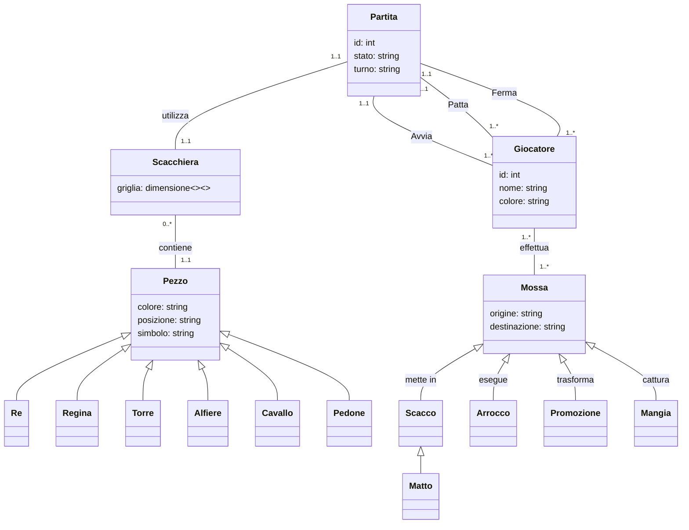

## RELAZIONE TECNICA DEL PROGETTO SCACCHI

## Indice
1. [Introduzione](#introduzione)
2. [Modello di dominio](#modello-di-dominio)
3. [Requisiti specifici](#requisiti-specifici)
   - [Requisiti funzionali](#requisiti-funzionali)
   - [Requisiti non funzionali](#requisiti-non-funzionali)
4. [Analisi retrospettiva](#analisi-retrospettiva)
   - [Sprint 0](#sprint-0)

## Introduzione
Questo progetto implementa una versione testuale del gioco degli **scacchi** utilizzando **Python**, giocabile direttamente da terminale. Due giocatori si alternano in locale, effettuando le loro mosse attraverso comandi testuali, rispettando le regole ufficiali degli scacchi.

L'obiettivo principale è offrire un'esperienza **interattiva**, senza interfaccia grafica, permettendo di sviluppare **competenze di programmazione** e confidenza con gli **ambienti di sviluppo**. Inoltre, il progetto è pensato per introdurre i concetti di **controllo versione** tramite **GitHub**, facilitando la gestione collaborativa del codice.

#### Caratteristiche principali
- **Gioco a turni** tra due giocatori in locale.
- **Validazione delle mosse** secondo le regole degli scacchi.
- **Interfaccia testuale** con input utente.
- **Gestione di scacco, scacco matto e patta**.
- **Utilizzo di GitHub** per versionamento e collaborazione.

#### Obiettivi
Questo progetto mira a:
- Applicare concetti di **programmazione Python**, gestione degli input e strutture dati.
- Approfondire l’uso di **GitHub**, imparando a versionare il codice e collaborare su repository.
- Sviluppare logica e algoritmi legati al **movimento dei pezzi** e alla gestione del gioco.

#### Tecnologie Utilizzate
- **Python** (logica di gioco e interfaccia testuale)
- **Git/GitHub** (gestione della versione del codice e collaborazione)

#### Riferimenti al team
Il progetto è realizzato grazie alla collaborazione dei membri del team "Milner": 
- [Amato Pierluca](https://github.com/PierluvaAmaro)
- [Catalano Mirco Saverio](https://github.com/catalanomircosav)
- [Nicola de Bari](https://github.com/nikegyz)
- [Amorosini Antonio](https://github.com/Shadow484)
- [Gesmundo Guglielmo](https://github.com/Ges201)
- [Amato Lorenzo](https://github.com/loreamat)

[Torna al menu](#indice)

---

## Modello di dominio
#### Che cosa è?
Un diagramma delle classi è una rappresentazione grafica utilizzata nella programmazione orientata agli oggetti per mostrare la struttura di un sistema.
 È uno strumento fondamentale per modellare il software, facilitando la comprensione del design e supportando la fase di sviluppo.

Ci sono diversi modi per rappresentare un diagramma delle classi, a seconda dello strumento e dello stile utilizzato. In questo progetto viene utilizzato il linguaggio di markup [Mermaid](https://docs.github.com/en/get-started/writing-on-github/working-with-advanced-formatting/creating-diagrams) per creare diagrammi direttamente in file Markdown.

#### Modello del progetto

[Torna al menu](#indice)

---

## Requisiti specifici
#### Requisiti funzionali

**RF1 – Visualizzazione dell'help**

Il sistema deve mostrare una descrizione concisa dell'applicazione seguita dall’elenco dei comandi disponibili, uno per riga, quando l’utente invoca uno dei seguenti comandi:
- `/help`
- `--help`
- `-h`

**RF2 – Avvio di una nuova partita**

Il sistema deve permettere di iniziare una nuova partita al comando `/gioca`, se non è già in corso una partita.

All’invocazione, l’applicazione deve:
- mostrare la scacchiera con i pezzi nella posizione iniziale;
- predisporre l'interfaccia per ricevere la prima mossa del bianco o altri comandi.

**RF3 – Visualizzazione della scacchiera**

Il sistema deve rispondere al comando `/scacchiera` con due comportamenti distinti:
- se il gioco **non è iniziato**, suggerisce l’uso del comando `/gioca`;
- se il gioco **è in corso**, mostra la posizione attuale di tutti i pezzi sulla scacchiera.

**RF4 – Abbandono della partita**

Il sistema deve permettere al giocatore di abbandonare la partita tramite il comando `/abbandona`.

Il comportamento deve essere il seguente:
- l’applicazione chiede conferma all’utente;
- se la conferma è **positiva**, comunica che l’avversario ha vinto per abbandono;
- se la conferma è **negativa**, resta in attesa di altri comandi o tentativi.

**RF5 – Proposta di patta**

Il sistema deve permettere al giocatore di proporre la patta tramite il comando `/patta`.

Il comportamento deve essere il seguente:
- l’app chiede conferma all’avversario;
- se l’avversario accetta, la partita termina in pareggio;
- se l’avversario rifiuta, il sistema si predispone a ricevere altri comandi.

**RF6 – Chiusura dell'applicazione**

Il sistema deve gestire la chiusura dell’applicazione tramite il comando `/esci`.

Il comportamento deve essere il seguente:
- l’applicazione chiede conferma;
- se la conferma è **positiva**, si chiude e restituisce il controllo al sistema operativo;
- se la conferma è **negativa**, si predispone a ricevere nuovi comandi.

**RF7 - Visualizzazione delle mosse**

Il sistema deve rispondere al comando `/mosse` mostrando la **cronologia delle mosse** effettuate nella partita in corso, utilizzando la **notazione algebrica abbreviata in italiano**.

Esempio di output atteso:
e4 c6
d4 d5
Cc3 dxe4
Cxe4 Cd7
De2 Cgf6

Il formato deve essere leggibile e coerente con la notazione standard, per permettere ai giocatori di consultare facilmente lo storico delle mosse e analizzare l'andamento della partita.

[Torna al menu](#indice)

---

#### Requisiti non funzionali
- **RNF1**: L'applicazione deve essere eseguita all'interno di un container Docker.
- **RNF2**: L'applicazione deve essere compatibile con i seguenti terminali:
  - Terminal di Linux
  - Terminal di macOS
  - PowerShell di Windows
  - Git Bash di Windows
- **RNF3**: L'applicazione deve utilizzare i simboli UTF-8 per la rappresentazione grafica dei pezzi degli scacchi: ♔ ♕ ♖ ♗ ♘ ♙ ♚ ♛ ♜ ♝ ♞ ♟.
  (Riferimento: [Wikipedia - Scacchi](https://it.wikipedia.org/wiki/Scacchi#Descrizione_e_regolamento))

[Torna al menu](#indice)

---

## Analisi retrospettiva
### Sprint 0
L'immagine rappresenta il risultato del team meeting svolto dopo lo Sprint 0, durante il quale abbiamo riflettuto sulle difficoltà incontrate e sulle soluzioni adottate. 
[Immagine PB sprint 0](./img/PB_Milner_S0.png)

[Torna al menu](#indice)

---

